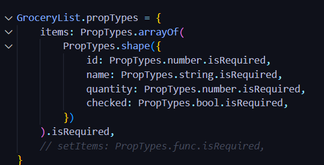

========================================================================================================================================================
----------------------------------------------------------------- /////// ------------------------------------------------------------------------------
========================================================================================================================================================

1. semua instalasi telah selesai dilakukan
2. mwngubah nama website pada [index.html]
3. masuk ke folder [src] yaitu tempat kita menyimpan seluruh file untuk aplikasi react
4. file entry point kita adalah [main.jsx]
5. [main.jsx] memanggil komponen <app> sebagai komponen utama dari aplikasi react
6. juga terdapat [index.css] yang akan menjadi file css utama.
7. semua style bisa disimpan disana tapi kalau mau lebih rapih css bisa disimpan secara *modular*

8. menghapus file [App.css]
9. pada [App.jsx]
    - hapus `import { useState } from 'react'` karena belum dibutuhkan
    - hapus logo react dan logo vite
    - hapus import css karena tadi sudah dihapus
    - hapus `const [count, setCount] = useState(0)`
    - hapus semua component pada return function App()

    - copy div.app pada `https://github.com/sandhikagalih/belajar-react-untuk-pemula/blob/main/4-catatan-belanja/starter-template/index.html`
    - paste kedalam return function App()

    - hapus semua isi pada [index.css]
    - copy semua style pada `https://github.com/sandhikagalih/belajar-react-untuk-pemula/blob/main/4-catatan-belanja/starter-template/index.css`
    - paste kedalam [index.css]

    - pada [App.jsx], ubah semua `class` menjadi `className`

    - semua persiapan sudah selesai
    - sebenarnya ini sudah di bungkus sama react tapi belum menjadi react yg utuh

10. mengubah seluruh struktur HTML menjadi component-component sendiri
    - pada `App.jsx > div.app` cut <h1>Catatan Belanjaku 📝</h1>
    - didalam folder [src] buat folder bernama [components]
    - didalam folder [components] buat file bernama [Header.jsx]
    - didalam file [Header.jsx] buat `export default function Header() { return() }` yang berisikan elemen <h1> tadi
    - pada [App.jsx] lakukan import `import Header from "./components/Header"`
    - kemudian tambahkan komponen <Header /> pada posisi <h1> tadi

    - lakukan hal yang sama tadi pada tag <form>
    - lakukan hal yang sama juga pada <div.list> dan <div.actions> keduanya dimasukkan dalam satu *function* dan digabung menggunakan *fragment*
    - lakukan hal yang sama pada tag <footer>

    - pada [App.jsx] masukkan : 
    - diatas diralat karena dapat *error* pada [GroceryList.jsx] di step bawah.
    - maka, fungsi `GroceryItems` tersebut dipindahkan ke [GroceryList.jsx] tepat didalam fungsi default.

    ~ harus menguasai `higher order function (map, filter, reduce)` ini penting karena pada react, data kita tidak boleh berubah isinya.
        kalaupun harus berubah, itu berarti *harus ditimpah* menggunakan `higher order function` karena dia membuat sebuah array baru tanpa
        mengubah array lama nya

    - pada [GroceryList.jsx] hapus 2 dari 3 tag <li> karena kita akan looping <li> menggunakan data yg ada didalam array
    - {} menandakan memasuki *mode javascript*
    - buat fungsi seperti ini `{GroceryItems.map((item) => () )};`
    - kemudian masukkan <li></li> kedalam fungsi tersebut.
    - maka akan muncul *error* karena jika kita pakai <ul> maka setiap child-nya harus memiliki *unique key*
    - maka kita akan menggunakan data yang unik, kita coba mengambil id yang ada didalam `item`
    - menjadi seperti ini <li key={item.id}>.....</li>
    - kondisi saat ini : 
    - looping sudah jalan, tetapi content masih ditulis manual
    - mengubah nilai menjadi relatif terhadap data : 

    - pada [GroceryList.jsx] > const GroceryItems > id = 1 > checked `true`. Nilai di set true tapi pada web terbada false (kecoret)
    - maka kita harus cek, apakah item nya `checked` atau tidak, if true = style coret, if false = jangan.
    - menjadi begini : 

    - bentar kita akan menambahkan checkbox dan delete button, jadi tag <li></li> akan sangat ramai / besar
    - maka kita akan menjadikan tag <li> tersebut menjadi `component` bernama <Item />
    - kemudian tetap pada [GroceryList.jsx] kita buat `function Item()` berisikan return tag <li> tadi
    - kemudian kita akan menemukan *error* yaitu `item` tidak dikenali karena `component` ini tidak tahu data item itu apa
    - maka kita akan kirim sebagai *props* bernama `item` yang berisi obj `item` : <Item item={item} />
    - kita masih menemukan *error* karena membutuhkan key props
    - maka kita akan tambahkan : <Item item={item} key={item.id} />
    - lalu kita *tangkap props* dalam parameter menjadi `function Item({ item })`
    - kita masih menemukan *error* karena kehilangan *props validation* ceunah
    
    - how to solve this fking prob?
    - tambahkan `import PropTypes from 'prop-types'`
    - tambahkan : 
    - lakukan `npm install prop-types`

11. lanjut broo
    - pada [Form.jsx] terdapat 5 buah tag <option> kalau mau 50 apakah kita perlu copas 50 line? tentu tidak dekku
    - maka kita buat dinamis menggunakan looping
    - buat `const quantityNum =` yg akan berisi array yg memiliki *spread operator* yaitu [...Array(20)] artinya buat 20 arr dgn value `undefined`
    - [..Array(20)].map() yang masing" akan kita map kedalam sebuah function untuk membentuk option nya
    - menjadi : 

12. saatnya menggunakan *state*
    - data dari nama barang akan kita kelola agar bisa masuk kedalam array kita dan tampil di browser
    - kita akan mengelola 2 state yaitu nama barang dan quantity nya berapa
    - jangan lupa perhatikan `import { useState } from "react"`
    - pada [Form.jsx] didalam Function Form kita mendeklarasikan state `const [name, setName] = useState('');`
    - kemudian buat function untuk menangani perubahan statenya ini akan meng-handle ketika data kita kirim di form nya, bisa ketika
        tombol diklik atau ketika form disubmit
    - maka kita akan membuat fungsi bernama `handleSubmit()` yang akan dipanggil ketika sebuah `event`
    - event nya pada tag <form> ditambahkan `onSubmit={handleSubmit}`
    - kita tes dengan menambahkan alert pada fungsi tadi
    - semua jalan tapi ketika kita lihat pada `link web` terdapat tanda *?* yg artinya form disubmit pakai browser (jadi halaman ngerefresh)
    - karena kita tidak mau melakukan fungsi default dari browser, maka

    - pertama kita kasih parameter `e` pada fungsi `handleSubmit`
    - didalam fungsi kita akan mematikan fungsi default dengan menambahkan `e.preventDefault()`
    - selanjutnya karena data tidak terkirim, maka
    - maka kita akan membutuhkan data dari tag <input>
    
    - pada tag <input> tambahkan attribute `value={name}` yang akan berisi apapun yg kita ketikkan di inputnya. kita ambil dari `state name`
    - kita menemukan *error* dimana kita tidak dapat mengetikkan apapun, karena value nya stuck di kosong ('')
    - maka kita butuh cara agar `value` berubah ketika kita mengetikkan sesuatu di inputnya
    - maka kita membetuhkan sebuah `event` lagi
    - `onChange` ketika value berubah (mengetikkan sesuatu) > kita ubah `name` menggunakan fungsi `setName` yg isinya akan diganti sesuai `value` nya.
    - untuk mengambil `value` dlm <input> menggunakan teknik `event (e)` tadi. `e.target.value` artinya mengambil value dari elemen yg bersangkutan.
    - `onChange={setName(e.target.value)}` tapi muncul (e is not defined)
    - maka kita kasih *anonymous function* menjadi `onChange={(e) => setName(e.target.value)}`
    - untuk memastikan apakah state sudah berubah maka kita ubah alert tadi dengan value `name`
    - kita juga bisa cek pada *inspect component* maka akan : 
    - sekarang data sudah bisa diambil dan masuk kedalam state nya

    - sekarang kita akan menangkap `value` dari element <select> untuk masuk ke sebuah state baru
    - jadi kita akan membuat state dan event juga
    - pertama kita membuat state dengan nilai default 1 `const [quantity, setQuantity] = useState(1);`
    - kemudian berikan attribute value pada element <select> `value={quantity}`
    - kemudian berikan attribute event pada element <select> `onChange={(e) => setQuantity(e.target.value)}`
    - kita sudah punya dua data yaitu `quantity` dan `name` berikutnya akan kita rangkai kedalam sebuah `objek`

    - pada `function handleSubmit()` kita membuat sebuah variable yg akan dijadikan objek bernama `newItem` berbentuk objek berisi dua data tadi
    - `const newItem = { name: name, quantity: quantity }` ketika nama property dan value sama maka, `const newItem = { name, quantity }`
    - berikutnya kita butuh `checked` dengan nilai default false, maka `const newItem = { name, quantity, checked: false }`
    - terakhit kita butuh id, harus kita generated saja. bisa menggunakan `uuid` atau `bilangan random`
    - biar simple kita generate dari tanggal saja `id: Date.now()` ini akan mengambil data berupa detik yg berjalan *sejak 1 januari 1970 - sekarang*
    - kita cek console `console,.log(newItem)` sebelum dimasukkan kedalam array
    - *problem* : quantity masih dalam bentuk `string`.
    - *problem* : ketika data sudah ditambahkan, data yang diketik tidak terhapus (masih ada)
    ~ install extension *console ninja* ceunah. tapi saya belum merasa penting wkwk
    
    - saya mau, ketika user selesai `menambahkan` data maka `inputan` akan kosong / kembali ke default. dan quantity kembali `1`
    - maka kita perlu `set ulang` setName dan setQuantity
    - tambahkan `setName('');` dan `setQuantity(1);`

    - next kita ubah agar nilai dari `quantity` berupa angka
    - tadi pada <select> `setQuantity(e.target.value)` jadi `value` itu akan selalu string
    - maka kita perlu paksa menjadi number <select value={quantity} onChange={(e) =(ada.panah) setQuantity(Number(e.target.value))}>
    
    - next *problem* adalah ketika `nama barang` dikosongkan, data tetap terkirim dalam bentuk data kosong
    - maka kita perlu setting agar kalau kosong tidak bisa klik `tambah`
    - kita bajak pakai yg namanya *Guard Clause* jadi didalam function kita bisa `jagain` dulu sebelum melakukan apaapa
    - kita bisa tambahkan `if(name === '') return` bisa juga `if(!name) return` sama saja
    - bacanya, ketika name false, langsung return / keluar dari function. jangan lakukan apapun dibawah ini
    - aman

    - sekarang bagaimana caranya agar data yang sudah kita kelola didalam `component form` bisa masuk kedalam `component grocerylist`
    - *state tidak bisa dikirim antar component yang sebelahan / siblings*
    - *state hanya bisa dikirim dengan konsep one way flow / dari atas kebawah / dari parent ke child nya*
    - kalau misalkan didalam `component GroceryList` terdapat `component Item`. nah kita bisa kirim data nya sebagai `props`
    - solusinya yaitu dengan menggunakan konsep *Lifting State Up*
    - agar semua component sibling / children / anak"nya memiliki akses ke state yang ada di parent nya.
    - artinya data / state yang ada di component Form kita harus angkat terlebih dahulu ke component atasnya.
    - sehingga component-component lain yang ada di komponen atasnya tadi bisa punya akses ke state nya juga.
    - berarti state akan dikirim ke `component App` sehingga bisa dibagikan ke component" children nya yg membutuhkan.
    - pertama kita perlu menyediakan tempat penyimpanan semua item didalam component parent.

    - pada [App.jsx] function App(), tambahkan state baru `const [items, setItems] = useState(groceryItems);`
    - sekarang kita akan bikin agar `GroceryList` nampilin data lewat array yang kita kirim sebagai props.
    - pada function App() return component <GroceryList> tambahkan attribute `items={items}`
    - pada function GroceryList() dalam tag <ul> `{GroceryItems.map((item) => (...))}` GroceryItems diganti dengan `items` saja.
    - pada function `GroceryList()` definisikan `items` lewat props yang kita tangkap `function GroceryList({ items })`
    <!-- - *SEGMEN INI HANYA BISA DITERAPKAN KETIKA SEMUA CHILD COMPONENT DARI COMPONENT APP BERADA DI SATU FILE YANG SAMA*
    -
    - *SEGMEN INI DAPAT DITERAPKAN KETIKA MEMISAHKAN SETIAP COMPONENT-COMPONENT DALAM FILE YANG BERBEDA-BEDA*
    - ubah state di komponen `GroceryList` : hapus data `GroceryItems`. karena kita akan menggunakan state yang diangkat dari komponen induk.
    - alihkan `items` yg diterima sebagai prop sebagai state komponen `GroceryList`
    - kirim `props` ke component `GroceryList` : pada component `App` kirimkan `items` state dan fungsi `setItems` sbg component ke `GroceryList`
    - pada [App.jsx] component `GroceryList` tambahkan attribute `items={items}` dan `setItems={setItems}`
    - menggunakan props di component `GroceryList` : di komponen `GroceryList`, gunakan `items` dan `setItems` yang diterima sebagai prop.
    - ubah interaksi dengan state untuk mengganti state menggunakan `setItems`
    - gunakan `setItems` di component `item` : pada component `item` gunakan fungsi `setItems` untuk memperbarui state `items` ketika status berubah
    - beberapa di skip karena aneh bingung -->
    - abaikan comment
    - kemudian akan muncul err msg yaitu `items is missing in props validation` dan `items.map is missing in props validation`
    - maka kita tambakan : 

    - sekarang tinggal kita cari cara untuk mengelola nya
    - pada [App.jsx] kita membuat function untuk menangani ketika ada perubahan, perubahan ketika kita berhasil menambahkan `item baru` dari `Form`
    - `function handleAddItem(){}` sebuah fungsi yg menangani ketika ada item baru yang masuk kedalam array `items` atau state `items`
    - pada `function handleAddItem(){}` kita akan mengubah nilai dari `items` dengan cara menambahkan `obeject baru` kedalam `items` : `setItems()`
    - berarti fungsi `handleAddItem()` akan menerima objek baru sebagai `item` : `function handleAddItem(item){}`
    - kita bisa gunakan array dengan `setItems(items.push(item));` tapi ingat dengan melakukan ini, array `items` itu berubah.
    - kita tidak mau itu, kita harus `bikin duplikat` nya -> kita tambahin di duplikat nya -> baru kita timpah. ini cara yg benar
    - jadi kita `spread dulu items` nya jadi array baru yg isinya persis sama dengan `array items` : `setItems([...items])`
    - lalu diakhir kita tambahkan satu elemen baru yaitu `item` : `setItems([...items, item])`
    - jadi ini akan membuat sebuah array baru yang nambah satu (item) di belakangnya. Hal ini dilakukan ketika kita menjalankan `event` atau `function`
    - `handleAddItem()` dijalankan ketika `component Form` ngesubmit data baru
    - sehingga kita butuh memasukkan kedalam `props` nya
    - maka pada component <Form /> kita menambahkan event `onAddItem={handleAddItem}`. fungsinya ada di `compoent parent` lalu masuk sebagai `props` tinggal ditangkap di dalam component Form pada [Form.jsx] nya

    - pada `function Form()` di [Form.jsx], kita buka object dan desctructuring : `export default function Form({ onAddItem })`
    - jadi ketika event `onAddItem` dijalankan, kita akan masukkan `item baru` kedalam fungsi `handleAddItem()`
    - *err msg* : `onAdditem` is missing in props validation
    - maka kita tambahkan `import PropTypes from 'prop-types'`
    - kemudian kita tambahkan `Form.propTypes = { onAddItem: PropTypes.func.isRequired, }`
    - kemudian pada `function handleSubmit(e)` kita tambahkan `onAddItem(newItem)` : 
    
    - sekarang `component Form` dan `component GroceryList` memiliki akses ke *state items*
    - jadi pada saat kita submit, maka jalankan event `handleSubmit` -> buat objek baru berdasarkan `Form` tadi -> masukkan ke event `onAddItem` yang 
        ada di `component App`. yang berfungsi menambahkan item baru yg dikirim sebagai `parameter` (nama beda gpp) dimasukkan ke state `items`
    - sekarang data sudah masuk ke tampilan list : 
    - nanti misalkan data sudah bertambah banyak, kertas bisa di scroll

    - selanjutanya kita coba menjalankan fungsi hapus
    - didalam [App.jsx] kita buat `function handleDeleteItem()`
    - selanjutnya kita cari tahu, yang ingin di `delete` itu `item` yang mana (biar tidak terhapus semua / menyeluruh)
    - berarti kita perlu identifier yang unique yaitu `id`
    - jadi fungsi `handleDeleteItem` menerima `id` sebagai parameter nya
    - selanjutnya kita cari tahu, bagaimana caranya menghilangkan sebuah elemen pada `array` berdasarkan `id` tertentu
    - sebelum itu kita tambahkan `setItems()` untuk mengubah array items kita
    - kita gunakan `higher order function` yaitu `filter`
    - jadi kita akan filter semua elemen kecuali yang ada `id` nya. Karena yang ada `id` nya yang mau dihapus
    - kita panggil array `items` lalu kita  jalankan kedalam `funtion callback`, lalu kita telusuri, lalu kita `filter setiap item`,
        kasih arrow faunction  lagi, kemudian cek / cari yang `item id nya itu tidak sama dengan id`. Jadi kembalikan nilai array kecuali
        yang sedang kita klik: `setItems((items) => items.filter((item) => item.id !== id));`
    - jadi sekarang ada array baru yang isinya `selain` array yang di delete.
    
    - `handle` sudah, sekarang kita buat `event` sebagai `props` nya.
    - karena kita ingin menampilkan di `list nya` maka kita tambahkan pada component <GroceryList /> pada [App.jsx]
    - tambahkan event : `onDeleteItem={handleDeleteItem}`
    - kemudian pada `component GroceryList( items )` pada [GroceryList.jsx] tangkap `event` sebagai `props`, tambahkan `onDeleteItem`
    - kemudian aksinya mau di simpan dimana?
    - jadi aksi di taruh di pada component <Item item={item} key={item.id} /> menjadi <Item item={item} key={item.id} onDeleteItem={onDeleteItem} />
    - kemudian kita masuk ke `component function Item()`. tangkap `onDeleteItem` sebagai `props` / param
    - selanjutnya pada `function Item({ item, onDeleteItem })` di tag <button>. sekarang kita akan menjalankan disebuah `event onClick`.
    - jadi ketika tombol diklik, jalankan `event onDeleteItem` : <button onClick={onDeleteItem}>
    - sekarang kita butuh mengirim `id` karena tadi kita butuh id pada `fungsi handle` : <button onClick={onDeleteItem(item.id)}>
    - ada *error*.
    - kalau kita pakai kurung itu artinya, fungsi akan `langsung dijalankan`. Kita mau fungsi berjalan ketika `tombol diklik`
    - maka kita akan masukkan kedalam sebuah *anonymous function* : `<button onClick={() => onDeleteItem(item.id)}>&times;</button>`
    - aman broooo

    - berikutnya kita akan menambahkan `fitur checkbox` dimana ketika box di check, nama item akan `dicoret`
    - disini kita akan menghubungkan `attribute checked` yang awal bgt dengan `tombol nya`
    - *logika*: ketika salah satu checkbox di ceklis, kita akan ubah property checked bernilai false menjadi true atau sebaliknya
    - berarti cari `id`, kemudian cocokkan dengan `array/state items`, kalau ketemu, bikin `array baru` yang checked nya berisi `kebalikannya`
    - letsgoo
    - didalam [App.jsx] kita buat `function handleToggleItem()`
    - kita perlu identifier yang unique yaitu `id` untuk mengetahui mana yang akan kita ubah-ubah (toggle) : ` func handleToggleItem(id) {}`
    - tambahkan `setItems()`
    - kemudian kita panggil items nya `setItems((items) )`
    - *kita gunakan map karena array nya sama || sedangkan tadi kita menggunakan filter karena array nya berbeda*
    - kemudian petakan `setItems((items) => items.map((item) => item.id === id ? {...item, checked: !item.checked} : item ))`
    - kita cek item.id sama ga dengan yang diklik, kalau sama maka itu yang dipilih untuk diubah checked nya.
    - bacanya: cek if ketemu yang sedang diceklis, `bikin objek baru` yang checked nya `kebalikan checked awal` nya. selain yang diklik biarkan saja

    - pada component <GroceryList /> pada [App.jsx], tambahkan `onToggleItem={handleToggleItem}`
    - pada component `function GroceryList()` pada [GroceryList.jsx], tambahkan `onToogleItem` didalam parameter nya
    - pada component <Item /> pada [GroceryList.jsx], tambahkan `onToggleItem={onToggleItem}`
    - pada component `function Item()` pada [GroceryList.jsx], tambahkan `onToggleItem` didalam parameter nya
    - pada tag <input type="checkbox"> didalam `function Item()`, tambahkan `onChange={() => onToggleItem(item.id)}`
    - kemudian pada [GroceryList.jsx] tambahkan / perika : 
    - ada *error* dimana ini tidak otomatis diceklis : 
    - pada tag <input type="checkbox"> didalam `function Item()`, tambahkan attribute `checked={item.checked}`

    - berikutnya kita akan menambahkan `fitur bersihkan daftar`
    - pada `function App()` pada [App.jsx], tambahkan `function handleClearItems(){}`
    - tidak perlu parameter karena ini akan menghapus semuanya
    - isi dengan, `setItems([]);` bikin menjadi array kosong
    - pada component <GroceryList /> pada [App.jsx], tambahkan `onClearItems={handleClearItems}`
    - pada component `function GroceryList()` pada [GroceryList.jsx], tambahkan `onClearItems` didalam parameter nya
    - pada component `function GroceryList() return` bagian <button>Bersihkan Daftar</button>, tambahkan `onClick={onClearItems}`

    - berikutnya kita akan menambahkan `fitur sorting`
    - kita tidak perlu mainin state pada `func App()` karena kita tidak memanipulasi array items melainkan hanya memindahkan urutannya saja
    - maka kita cukup menggunakan `fungsi sorting array` saja
    - pada component `function GroceryList()` pada [GroceryList.jsx], tambahkan state baru `const [sortBy, setSortBy] = useState('input')`
    - pada component `function GroceryList()` bagian <select>, tambahkan attr `value={sortBy}` ketika select berubah maka ambil nilainya
    - pada component `func GroceryList()` bagian <select>, tambahkan attr `onChange` ketika kita ganti, `setSortBy()` nya ngambil dari inputan
    - cara untuk ambil inputan, kita butuh masukkan dulu kedalam sebuah `arrowfunc e`: `onChange={(e) => setSortBy(e.target.value)}`

    - mau diurutkan berdasarkan apanya? kita manipulasi array nya
    - pada component `function GroceryList()`, tambahkan array baru yang akan ditimpah" `let sortedItems;`
    - kemudian kita cek, sekarang `sortBy` nya lagi berisi apa: `if( sortBy === 'input' ) { sortedItems = items; }`
    - jika `sortBy` berisi input (default), maka `sorted items` akan berisi `items`
    - kemudian `items` ditanda :  diganti dengan `sortedItems` yaitu hasil urutannya
    - tambahkan `if(sortBy === 'name'){ sortedItems = items.slice().sort((a,b) => a.name.localeCompare(b.name)) }` diurutkan berdasaarkan nama
    - *untuk mengurutkan nama didalam objek bisa pakai cara diatas*
    - belajar cara kita nge sort di dalam array: `https://developer.mozilla.org/en-US/docs/Web/JavaScript/Reference/Global_Objects/Array/sort`
    - terakhir tambahkan `if(sortBy === 'checked'){ sortedItems = items.slice().sort((a,b) => a.checked - b.checked) }`
    - dimana sortingan berdasarkan false ( yang belum dicheck, yang teratas )
    - kita rapikan :  menggunakan *switch operator*
    - jika `if hanya dua` pakai *ternary*. kalau `if ada tiga` better *switch* : 

    - berikutnya kita akan menambahkan `fitur statistic / recap`
    - kita minta informasi `state items` dari [App.jsx]
    - pada component <Footer /> pada [App.jsx], tambahkan attr `items={items}`
    - pada component `function Footer()` pada [Footer.jsx], tambahkan `items` didalam parameternya
    - *tidak perlu state karena* tidak akan berubah oleh aksi dari user, dia hanya recap saja.
    - kita akan `pecah objek` kedalam 3 variable yaitu jumlah, total belanjaan, dan persentase
    - pada component `function Footer()`, tambahkan `const totalItems = items.length` kita tinggal hitung panjang dari arraynya
    - tambahkan `const checkedItems = items.filer((item) => item.checked).length` kita filter untuk mencari checked bernilai true
    - tambahkan `const percentage = Math.round((checkedItems / totalItems) * 100)`
    - saatnya dimasukkan ke setiap string nya
    - dari : . menjadi: 

    - terdapat *error* ketika kita `membersihkan daftar` dimana pada `{percentage}` mengeluarkan nilai `NaN%` (Not a Number) karena nol bagi nol
    - maka kita akan mengakali dimana semua pada `function Footer()` tidak akan berjalan kalau `items` nya `kosong`
    - kita bikin *guard* : `if(items.length === 0) return <footer className="stats">Daftar belanjaan masih kosong!</footer>`

    - pada `function Item()` pada [GroceryList.jsx] saya pindahkan alias memisahkan file komponennya menjadi file komponen baru [Item.jsx]
    - saya memindahkan `function component` dan `props validation`
    - pada [Item.jsx], tambahkan `import PropTypes from "prop-types"`
    
    - terakhir memasukkan file [App.jsx] kedalam folder [components]
    - kemudian muncul *alert* yaitu `update imports for App.jsx?` pilih `yes`
    - maka semua href pada import di App.jsx akan berubah
    - pada [main.jsx], `import App` ubah href dari `./App.jsx` menjadi `./components/App`

    - SELESAI